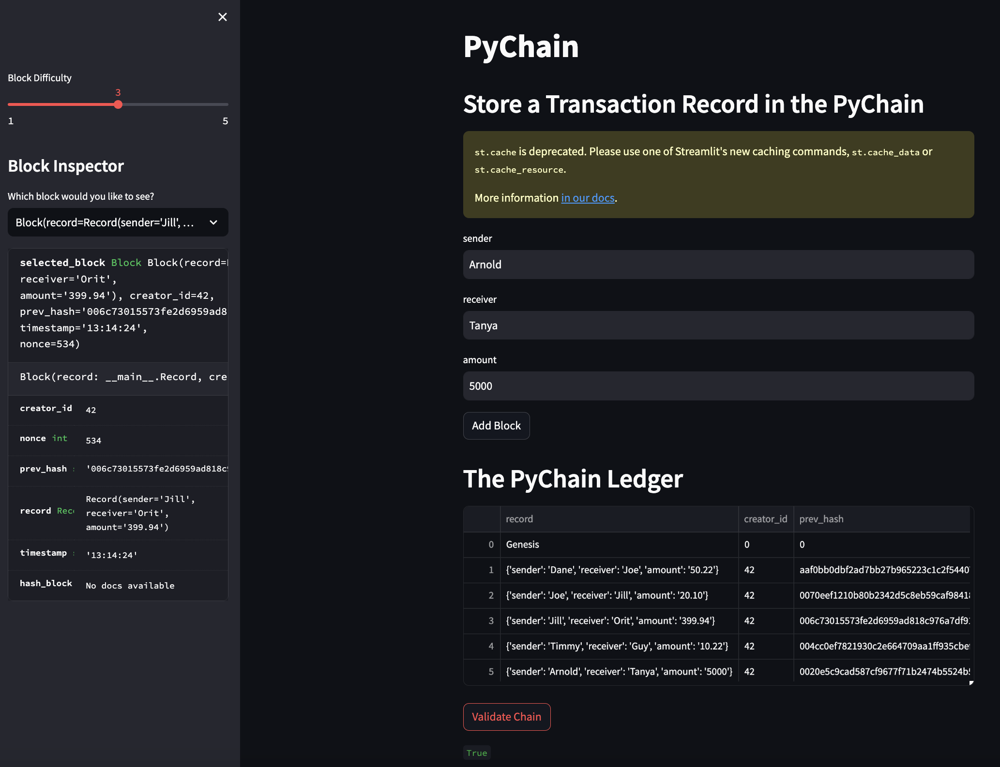

# PyChain Ledger

Create a `PyChain` ledger:

1. Create a new data class named `Record`. This class will serve as the blueprint for the financial transaction records that the blocks of the ledger will store.

2. Modify the existing `Block` data class to store `Record` data.

3. Add Relevant User Inputs to the Streamlit interface.

4. Test the PyChain Ledger by Storing Records.

## Files

[Code](pychain.py)

## Submission

This streamlit app was created to record financial transactions within a blockchain.  Each Record includes a sender, receiver, and amount.  All entries are validated by hashing the previous block and including in the new block.  After storing records, we verify the chain by testing for accuracy. 

### Validation of proper functionality:

